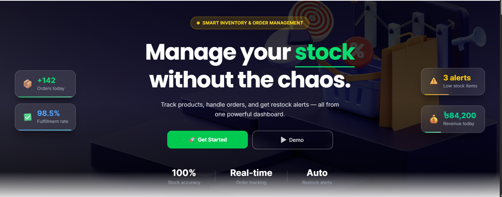

# pick&pack — Smart Inventory & Order Management System

> A full-stack web application to manage products, stock levels, customer orders, and fulfillment workflows — built with Next.js, Express.js, and MongoDB.

---

## 🌐 Live Demo

| Service | URL |
|---|---|
| Frontend | `https://pick-pack-frontend.vercel.app` |
| Backend API | `https://pick-pack-backend.onrender.com` |

**Demo Credentials:**
```
Email:    demo@pickpack.com
Password: demo1234
```

---

## 📸 Preview



---

## ✨ Features

### 🔐 Authentication
- Email & Password based signup/login
- JWT token authentication
- Role-based access control (Admin / Manager / User)
- Demo login with pre-filled credentials
- Protected routes with middleware

### 📦 Product Management
- Add, edit, delete products
- Assign categories to products
- Set price, stock quantity & minimum stock threshold
- Auto status update → `Out of Stock` when stock hits 0
- Role-based: Admin & Manager can manage, others can view

### 🗂️ Category Management
- Create and manage product categories
- Used for organizing and filtering products
- Admin & Manager access only

### 🛒 Order Management
- Create orders with multiple products
- Auto stock deduction on order placement
- Conflict detection:
  - Duplicate product in same order → blocked
  - Inactive/out-of-stock product → blocked
  - Insufficient stock → warning with available quantity
- Status tracking: `Pending → Confirmed → Shipped → Delivered`
- Cancel order with automatic stock restoration
- **Role-based visibility:**
  - Admin & Manager → see all orders
  - Normal user → sees only their own orders

### 🔁 Restock Queue
- Auto-adds products to restock queue when stock falls below threshold
- Priority system: `High / Medium / Low` based on stock ratio
- Sorted by lowest stock first
- Manual restock with quantity input
- Auto-removes from queue when restocked

### 📊 Dashboard
- Total orders today
- Pending vs Completed orders count
- Low stock items count
- Revenue today
- Product stock summary with status indicators
- Recent activity feed (latest 10 actions)
- Revenue & order analytics chart

### 📝 Activity Log
- Tracks all system actions automatically
- Examples:
  - `Order #1023 created`
  - `Stock updated for "iPhone 13"`
  - `Product "Headphone" added to Restock Queue`
  - `Order #1023 marked as Shipped`

### 🎁 Bonus Features
- Search & filter products and orders
- Pagination for large datasets
- Analytics chart (orders & revenue)
- Role-based access (Admin / Manager / User)
- Responsive design (Mobile + Tablet + Desktop)
- Smooth animations with Framer Motion

---

## 🛠️ Tech Stack

### Frontend
| Technology | Purpose |
|---|---|
| Next.js 15 (App Router) | React framework |
| Tailwind CSS | Styling |
| Framer Motion | Animations |
| React Hook Form | Form handling |
| React Hot Toast | Notifications |
| SweetAlert2 | Confirmation dialogs |
| React Icons | Icon library |
| Axios | HTTP client |
| date-fns | Date formatting |

### Backend
| Technology | Purpose |
|---|---|
| Express.js | REST API server |
| MongoDB | Database |
| Mongoose | ODM |
| JSON Web Token | Authentication |
| bcryptjs | Password hashing |
| CORS | Cross-origin requests |
| dotenv | Environment variables |

---

## 📁 Project Structure

```
inventory-project/
│
├── pick-pack-frontend/          # Next.js Frontend
│   ├── app/
│   │   ├── (auth)/              # Login & Signup pages
│   │   ├── (dashboard)/         # Protected dashboard pages
│   │   │   ├── dashboard/
│   │   │   ├── products/
│   │   │   ├── categories/
│   │   │   ├── orders/
│   │   │   └── restock/
│   │   ├── layout.js
│   │   └── page.js              # Landing page
│   ├── components/
│   │   ├── ui/                  # Reusable UI components
│   │   ├── layout/              # Navbar, Sidebar
│   │   ├── landing/             # Landing page sections
│   │   ├── dashboard/           # Dashboard components
│   │   ├── products/            # Product form & table
│   │   ├── categories/          # Category form & table
│   │   ├── orders/              # Order form & table
│   │   └── restock/             # Restock table
│   ├── context/
│   │   └── AuthContext.js       # Global auth state
│   ├── lib/
│   │   ├── api.js               # Axios instance
│   │   └── auth.js              # localStorage helpers
│   └── hooks/
│       └── useAuth.js
│
└── pick-pack-backend/           # Express.js Backend
    └── src/
        ├── config/              # DB connection
        ├── controllers/         # Route handlers
        ├── models/              # Mongoose schemas
        ├── routes/              # API routes
        ├── middleware/          # Auth & error handlers
        ├── utils/               # Helpers & constants
        └── server.js
```

---

## 🚀 Getting Started

### Prerequisites
- Node.js v18+
- MongoDB Atlas account
- Git

---

### 1. Clone the repository

```bash
git clone https://github.com/yourusername/pick-pack.git
cd pick-pack
```

---

### 2. Backend Setup

```bash
cd pick-pack-backend
npm install
```

Create `.env` file:

```env
PORT=3001
MONGODB_URI=mongodb+srv://<username>:<password>@cluster.mongodb.net/inventory
JWT_SECRET=your_jwt_secret_here
CORS_ORIGIN=http://localhost:3000
NODE_ENV=development
```

Run the backend:

```bash
npm run dev
```

Backend runs on: `http://localhost:3001`

---

### 3. Frontend Setup

```bash
cd pick-pack-frontend
npm install
```

Create `.env.local` file:

```env
NEXT_PUBLIC_API_URL=http://localhost:3001/api
```

Run the frontend:

```bash
npm run dev
```

Frontend runs on: `http://localhost:3000`

---

## 🔑 API Endpoints

### Auth
| Method | Endpoint | Access | Description |
|---|---|---|---|
| POST | `/api/auth/signup` | Public | Register new user |
| POST | `/api/auth/login` | Public | Login user |
| GET | `/api/auth/me` | Protected | Get current user |

### Products
| Method | Endpoint | Access | Description |
|---|---|---|---|
| GET | `/api/products` | Protected | Get all products |
| POST | `/api/products` | Admin/Manager | Create product |
| PUT | `/api/products/:id` | Admin/Manager | Update product |
| DELETE | `/api/products/:id` | Admin only | Delete product |

### Categories
| Method | Endpoint | Access | Description |
|---|---|---|---|
| GET | `/api/categories` | Protected | Get all categories |
| POST | `/api/categories` | Admin/Manager | Create category |
| PUT | `/api/categories/:id` | Admin/Manager | Update category |
| DELETE | `/api/categories/:id` | Admin only | Delete category |

### Orders
| Method | Endpoint | Access | Description |
|---|---|---|---|
| GET | `/api/orders` | Protected | Get orders (role-filtered) |
| POST | `/api/orders` | Protected | Create order |
| PUT | `/api/orders/:id/status` | Admin/Manager | Update order status |
| PUT | `/api/orders/:id/cancel` | Protected | Cancel order |

### Restock
| Method | Endpoint | Access | Description |
|---|---|---|---|
| GET | `/api/restock` | Protected | Get restock queue |
| PUT | `/api/restock/:id` | Admin/Manager | Restock product |

### Stats
| Method | Endpoint | Access | Description |
|---|---|---|---|
| GET | `/api/stats` | Public | Get public stats |

---

## 👥 User Roles

| Feature | Admin | Manager | User |
|---|:---:|:---:|:---:|
| View products | ✅ | ✅ | ✅ |
| Add/Edit products | ✅ | ✅ | ❌ |
| Delete products | ✅ | ❌ | ❌ |
| View all orders | ✅ | ✅ | ❌ |
| View own orders | ✅ | ✅ | ✅ |
| Create orders | ✅ | ✅ | ✅ |
| Update order status | ✅ | ✅ | ❌ |
| Manage categories | ✅ | ✅ | ❌ |
| Delete categories | ✅ | ❌ | ❌ |
| Restock products | ✅ | ✅ | ❌ |
| View dashboard | ✅ | ✅ | ✅ |

---

## 🌍 Deployment

### Frontend — Vercel
```bash
cd pick-pack-frontend
vercel --prod
```

Add environment variable in Vercel dashboard:
```
NEXT_PUBLIC_API_URL=https://your-backend-url.onrender.com/api
```

### Backend — Render / Railway
1. Push backend to GitHub
2. Connect to Render / Railway
3. Add environment variables:
```
PORT=3001
MONGODB_URI=...
JWT_SECRET=...
CORS_ORIGIN=https://your-frontend.vercel.app
NODE_ENV=production
```

---

## 📦 Environment Variables Summary

### Backend `.env`
```env
PORT=3001
MONGODB_URI=mongodb+srv://...
JWT_SECRET=...
CORS_ORIGIN=http://localhost:3000
NODE_ENV=development
```

### Frontend `.env.local`
```env
NEXT_PUBLIC_API_URL=http://localhost:3001/api
```

---

## 🤝 Contributing

1. Fork the repository
2. Create your feature branch: `git checkout -b feature/amazing-feature`
3. Commit your changes: `git commit -m 'Add amazing feature'`
4. Push to the branch: `git push origin feature/amazing-feature`
5. Open a Pull Request

---

## 👨‍💻 Author

**Nishat Jahan** — Full Stack Developer

- GitHub: [@NishatJahan](https://github.com/nishatjahan62)

---

<div align="center">
  <strong>pick&pack</strong> — Smart Inventory & Order Management
  <br/>
  Built with ❤️ using Next.js + Express.js + MongoDB
</div>